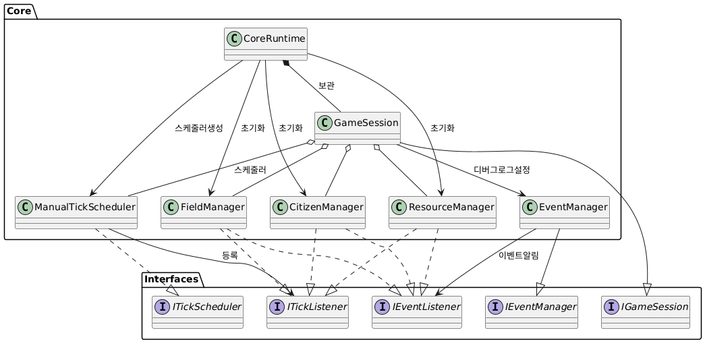
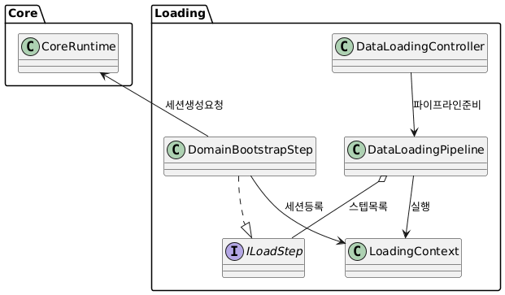
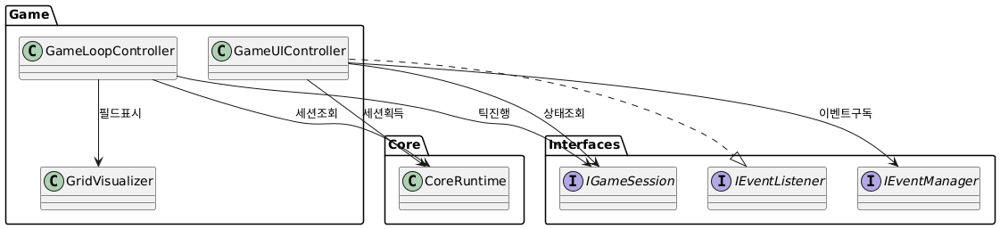

# UnityAutoWorld

UnityAutoWorld는 데이터 기반 이벤트 시스템을 테스트 하기 위한 자동 시뮬레이션 게임입니다.

## 프로젝트 개요 (Project Overview)

이 프로젝트는 플레이어가 직접 개입하기보다는, 규칙과 시스템을 설정하여 세계가 스스로 동작하고 성장하는 것을 관찰하는 데 중점을 둡니다. `ScriptableObject`를 활용한 데이터 기반 설계를 통해 높은 확장성과 유연성을 목표로 합니다.

## 핵심 게임플레이 특징 (Core Gameplay Features)

*   **그리드 기반 월드 (Grid-Based World):** 모든 상호작용과 건설은 정해진 그리드 위에서 이루어집니다.
*   **자원 및 인구 관리 (Resource & Population Management):** 다양한 자원을 생산하고 소비하며, 인구 증가 규칙에 따라 세계의 규모가 변화합니다.
*   **작업 및 직업 시스템 (Task & Job System):** 시민(또는 에이전트)에게 직업을 할당하고 작업을 부여하여 생산 및 건설을 자동화합니다.

## 주요 기술 아키텍처 (Key Technical Architecture)

이 프로젝트는 유연하고 확장 가능한 구조를 위해 다음과 같은 핵심 아키텍처 패턴을 기반으로 설계되었습니다.

*   **데이터 기반 설계 (Data-Driven Design)**
    *   게임의 핵심 데이터(자원, 직업, 필드 정보 등)를 코드에서 분리하기 위해 `ScriptableObject`를 적극적으로 활용합니다.
    *   `Assets/Datas/` 폴더 내의 `.asset` 파일들이 바로 이 데이터 에셋들입니다. 특히 `EventActions.asset`과 같은 파일을 통해, 특정 '이벤트(Event)'가 발생했을 때 어떤 '행동(Action)'이 실행될지 미리 정의하고 조합할 수 있습니다. 이를 통해 코드를 재컴파일하지 않고도 새로운 상호작용 로직을 손쉽게 추가하거나 변경할 수 있습니다.

*   **이벤트 기반 시스템 (Event-Driven Architecture)**
    *   `EventManager`, `GameEvents`, `IEventListener` 인터페이스를 중심으로 하는 이벤트 시스템을 구현했습니다.
    *   이를 통해 각 게임 시스템(UI, 자원 관리, 인구 등)은 서로 직접 참조하지 않고, '이벤트'를 통해 통신합니다. 이는 시스템 간의 결합도를 낮춰 코드를 더 모듈화하고, 테스트와 유지보수를 용이하게 만듭니다.

*   **커스텀 틱 기반 시뮬레이션 (Custom Tick-Based Simulation)**
    *   Unity의 `Update()` 프레임 속도에 종속되지 않는 독자적인 시뮬레이션 루프를 사용합니다.
    *   `ITickScheduler`와 `ITickListener`를 통해 구현된 이 시스템은 정해진 시간 간격(Tick)마다 게임의 핵심 로직(자원 생산, 인구 변화 등)을 실행합니다.
    *   이를 통해 게임 속도 조절(배속, 일시정지)과 같은 기능을 다른 게임요소들에 독립적으로 구현할 수 있습니다.

## 프로젝트 구조 (Project Structure)

프로젝트의 주요 폴더와 역할은 다음과 같습니다.

```
/AutoWorld/Assets/
├───Datas/         # ScriptableObject 기반의 모든 게임 데이터 에셋
├───Prefabs/       # 재사용 가능한 게임 오브젝트 (UI, 캐릭터 등)
├───Scenes/        # 게임의 주요 씬 (로딩, 메인 게임 등)
└───Scripts/
    ├───Core/      # 게임의 가장 핵심적인 로직과 데이터 구조
    │   ├─── Data/
    │   ├─── Domain/
    │   └─── Services/ # 이벤트, 틱 시스템 등 범용 서비스
    ├───Game/      # 실제 게임 씬에서 동작하는 컨트롤러 및 구현체
    └───Loading/   # 데이터 로딩 씬에서 사용되는 스크립트
```

*   `Assets/Scripts/Core/`: 게임의 장르나 형태와 관계없이 재사용 가능한 핵심 로직을 담고 있습니다. 데이터 구조, 인터페이스(`IEventListener`), 핵심 시스템(`EventManager`, `TickScheduler`) 등이 포함됩니다.
*   `Assets/Scripts/Game/`: `Game.unity` 씬에 특화된 스크립트가 위치합니다. `GameLoopController`, `GameUIController` 와 같이 `Core`의 시스템을 활용하여 실제 게임플레이를 구현합니다.
*   `Assets/Scripts/Loading/`: `Loading.unity` 씬에서 게임 시작에 필요한 데이터를 미리 불러오는 `DataLoadingPipeline`과 같은 로직을 담당합니다.
*   `Assets/Datas/`: 게임의 모든 설정값이 여기에 파일 형태로 저장되어 있어, 코드 수정 없이 게임의 거의 모든 측면을 조정할 수 있는 중심적인 역할을 합니다.

## UML 다이어그램

Document/UML/ 내 다이어그램 이미지는 영역별 관계를 요약한 PlantUML 출력물입니다.

- **코어 시스템**: 
- **로딩 파이프라인**: 
- **게임 레이어**: 

## 시작하기 (Getting Started)

1.  이 프로젝트를 클론(Clone)합니다.
2.  Unity Hub에서 `AutoWorld` 폴더를 기존 프로젝트로 추가합니다.
3.  `Assets/Scenes/Loading.unity` 씬을 열고 Unity Editor에서 실행합니다.
4.  플레이어는 필드 변경과 직업 변경, 2가지 요소에만 개입할 수 있습니다.
